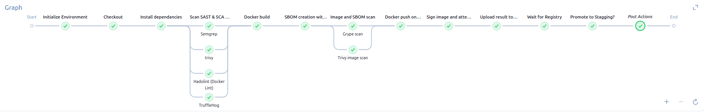
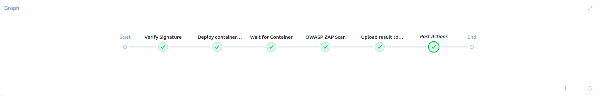

## Project Architecture

Jenkinsfile:
- Checkout (lightweight)
- Install dependancies (npm install)
- SAST/SCA/LINT/Secret scan (Semgrep, Trivy, Hadolint, TruffleHog)
- Docker build
- SBOM (Syft)
- SBOM/Image scan (Grype, Trivy)
- Docker push on Scaleway Registry
- Image and SBOM sign (Cosign, Vault transit)
- Upload security reports (DefectDojo)

Jenkins_staging :
- Verify image signature and SBOM (Cosign, Vault transit)
- Deploy container image (SCW CLI)
- Wait for container
- DAST (OWASP ZAP)
- Upload security reports (DefectDojo)

# Project Main focus :
- Jenkins (local): Discover a new CI-CD tool
- SLSA : immutable agent, immutable tags, cosign signing, private image registry, security in pipeline
- Security in pipeline : SAST, Lint, secret scan, SCA, DAST, DefectDojo
- Scaleway : Discover a french alternative for cloud
- Vault (local): transit and kv2

# Non-prod choices :

- Security tools on "|| true" : Actual Application is vulnerable
- Jenkins is not connected to github hook (manual)
- Terraform is launch as a CLI (not in a pipeline) : Project simplicity
- Jenkins deploy the new image with scw cli, that creates a state drift for terraform

- Manual Unseal of Vault : Vault is local, network unreachable
- VAULT_SKIP_VERIFY=true : Self-signed certificate

- Container public (testing and cost purposes) : This project focus on CI/CD and Vault, not on Cloud
- Local State for backend.tf : Simplify the project

## CI steps :
- **Github fork** - done
- **Jenkins Local Setup** - done
- **Jenkins pipeline with github** - done
- **semgrep & trivy scan** - done
- **DefectDojo Local Setup** - done
- DefectDojo Jenkins integration - done
- SBOM creation with syft - done
- Signature with cosign - done
- Certification of provenance ?

## Vault steps :
- Vault local Setup - done
- Vault Jenkins integration - done
  
## Deploy steps :
- Signature check - done
- OWASP ZAP DAST - done
- Scaleway IaC for VM and image registry - done
- automatic deployment - done
- Ops security ?

# Infra
docker-compose up -d
// launch django-DefectDojo
terraform apply
