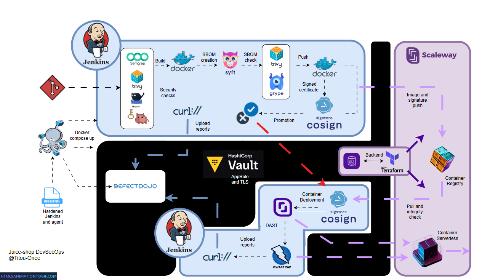

# Juice-shop-DevSecOps

A complete CI/CD pipeline applied to OWASP Juice Shop, an intentionally vulnerable web application-designed to explore and implement an end-to-end DevSecOps supply chain: security scans, SBOM, image signing, secret management with Hashicorp Vault and a deployment on Scaleway

---
## Table of Contents
- [Project Objectives](#project-objectives)
- [Project Architecture](#project-architecture)
- [Installation](#installation)
- [Technical Choices (Non-Prod)](#technical-choices-non-prod)
- [Progress](#progress)
---

## Project Objectives

This project serves as a personal hands-on laboratory focusing on several core areas:

1. **Jenkins (local):** Getting hands-on experience with a new CI/CD tool.
2. **SLSA Framework:** Explore with immutable agents, immutable tags, Cosign signing, private image registry, and built-in pipeline security.
3. **Pipeline Security:** SAST, linting, secret scanning, SCA, DAST, SBOM and vulnerability management centralized via DefectDojo.
4. **Scaleway:** Exploring a French cloud alternative.
5. **Vault (local):** Hands-on practice with Transit and KV v2 secret engines.
6. **Dockerfile and compose**: Hands-on experience in containerization

---

## Project Architecture

### Jenkinsfile : Continuous Integration
1. **Lightweight repository checkout**
2. **Dependency installation** (`npm install`)
3. **Static analysis & secret scanning**: Semgrep (SAST), Trivy (SCA), Hadolint (Dockerfile linting), TruffleHog (Secrets)
4. **Docker image build**
5. **SBOM generation** with Syft
6. **Image and SBOM scanning** with Grype and Trivy
7. **Image push** to the Scaleway container registry
8. **Image & SBOM signing** using Cosign, with keys managed via Vault Transit
9. **Security reports upload** to DefectDojo

### Jenkins_staging.groovy : Deployment
1. **Image and SBOM signature verification** (Cosign, Vault Transit)
2. **Container deployment** using the Scaleway CLI (`scw`)
3. **Wait for container availability**
4. **DAST scanning** with OWASP ZAP
5. **Security reports upload** to DefectDojo

### Vault : Approle and transit
1. **AppRole for application secrets** Scaleway, Jenkins and terraform
2. **Transit for signature** by usign Cosign

### Terraform : Scaleway
1. **Remote State** in Scaleway DB
2. **Container registry** for image and signature
3. **Serverless container** for application deployment
---
## Technical choices non prod:

- Security tools on "|| true" : Actual Application is vulnerable
- Jenkins is not connected to github hook (manual trigger)
- Terraform is launch as a CLI (not in a pipeline) : Project simplicity
- Jenkins deploy the new image with scw cli, that creates a state drift in terraform

- Manual Unseal of Vault : Vault is local, network unreachable
- VAULT_SKIP_VERIFY=true : Self-signed certificate

- Container public (testing and cost purposes) : This project focus on CI/CD and Vault, not on Cloud
- Local State for backend.tf not encrypted: Simplify the project

## Installation

Please follow in order : Defectdojo.md -> Vault-launch.md -> Terraform.md -> Jenkins.md
---
## Progress

### CI steps :
- **Github fork** - done
- **Jenkins Local Setup** - done
- **Jenkins pipeline with github** - done
- **semgrep & trivy scan** - done
- **DefectDojo Local Setup** - done
- **DefectDojo Jenkins integration** - done
- **SBOM creation with syft** - done
- **Signature with cosign** - done
- **Certification of provenance** - done

### Vault steps :
- **Vault local Setup** - done
- **Vault Jenkins integration** - done
- **Secret architecture** - done
- **Approle and policies** - done
- **Vault Transit** - done

### Deploy steps :
- **Signature check** - done
- **OWASP ZAP DAST** - done
- **Scaleway IaC for VM and image registry** - done
- **automatic deployment** - done
- **DefectDojo reports upload** - done

### Terraform : 
- **Vault connection** - done
- **Remote Backend** - done
- **Container Registry** - done
- **Automatic Vault secret upload** - done
- **Serverless Container** - done 

## Author

**Titouann Mauchamp**
Student at UTT / Network & telecommunication - Information Systems Security

